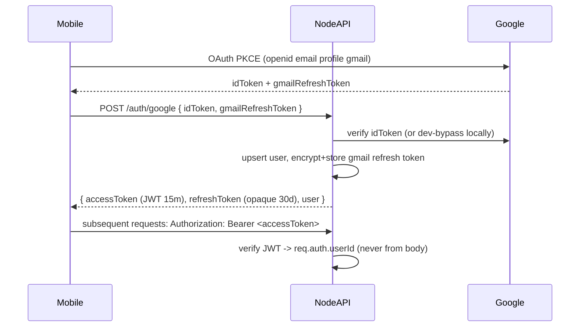
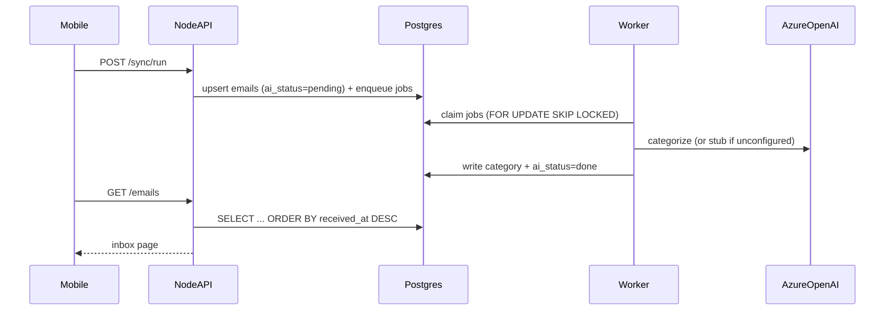

# Mail Tracker — architecture (Node + Expo + Postgres)

## Goals

- **Real multi-user auth**: the client authenticates with Google, and the server derives every user's identity from a verified token. The client never sends a `userId`, so cross-user access is structurally impossible.
- **AI only on the server**: Azure OpenAI keys exist only in `apps/api`. Categorization runs server-side in a background worker.
- **Secrets server-side & encrypted**: the Gmail refresh token is held only on the server, encrypted at rest with AES-256-GCM. The device holds only our short-lived session token.
- **Runs locally with zero cloud credentials**: Postgres via Docker, a Google dev-login bypass (blocked in production), a fixture inbox, and a stub AI fallback.

## Layout

| Path | Role |
|------|------|
| `apps/api` | Node.js + Express API (`/health`, `/auth/*`, `/emails`, `/sync/*`, `/ai/*`, `/push/*`) |
| `apps/mobile` | Expo (React Native) client |
| `packages/shared` | Shared Zod contracts + types (`@mailtracker/shared`) |
| `apps/api/prisma` | Prisma schema + migrations (Postgres) |
| `legacy/` | Archived .NET reference implementation |

## Authentication & session flow

- Access token: HS256 JWT, 15 min, verified offline.
- Refresh token: opaque random string; only its SHA-256 hash is stored in the `sessions` table, enabling revocation and rotation.

## Data flow (inbox + AI)

The job queue is a Postgres table drained by an in-process `setInterval` worker.
`FOR UPDATE SKIP LOCKED` makes it safe across replicas, and the identical loop
can be extracted into a standalone worker process later with no rewrite.

## Postgres schema (Prisma)

`users`, `gmail_accounts` (encrypted refresh token), `sessions` (revocable),
`emails` (composite PK `(user_id, message_id)`, indexed by received-at/category/ai-status),
`swipes`, `push_tokens`, `categorization_jobs` (the queue).

## Production hardening (API)

- `helmet` baseline HTTP headers; `pino`/`pino-http` structured logs.
- Zod validation on all bodies; centralized error handler (no stack traces in prod).
- CORS: set `CORS_ORIGINS` to an explicit allowlist in production (disabled by default if unset).
- The server **refuses to boot** in production if `DEV_TRUST_UNVERIFIED_GOOGLE=true`.

## Deliberate scope lines

- **Gmail push (watch + Pub/Sub) is deferred** — it needs a public HTTPS endpoint + GCP topic. Sync is pull-based (on-open + scheduled); `history_id` is stored so push is an additive upgrade.
- **Swipe write-back to Gmail** is not yet server-side; only inbox reads moved server-side.
- **Firebase** is off the data path (Postgres owns all app data); it remains only as an optional FCM push transport.

## Requirements

- **Node.js 20+**, or just **Docker** (recommended — no local Node needed).
