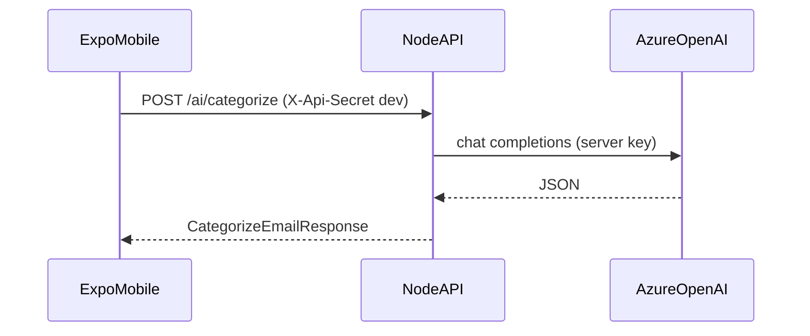

# Mail Tracker — architecture (Node + Expo)

## Goals

- **Single root `.env`**: local secrets and URLs live in one gitignored file at the repo root. Runtime code reads configuration through typed loaders (`apps/api/src/config/env.ts`, `apps/mobile/src/config/env.ts`), not scattered `process.env` reads.
- **AI only on the server**: Azure OpenAI keys exist only in `apps/api`. The mobile app calls `/ai/*` over HTTPS.
- **OAuth tokens on-device only**: Gmail refresh/access tokens stay in secure storage on the phone (planned: `expo-secure-store`). They are never written to Firebase RTDB or `.env`.

## Layout

| Path | Role |
|------|------|
| `apps/api` | Node.js + Express API (`/health`, `/ai/*`, `/sync/*`, `/push/*`) |
| `apps/mobile` | Expo (React Native) client |
| `packages/shared` | Shared Zod contracts + small helpers (`@mailtracker/shared`) |
| `legacy/` | Archived .NET MAUI + ASP.NET Core reference implementation |

## Request flow (AI)

## Production hardening (API)

- `helmet` for baseline HTTP headers.
- `pino` + `pino-http` for structured logs (secrets redacted from common headers).
- Zod validation on JSON bodies; centralized error handler (no stack traces in production JSON).
- CORS: in production, set `CORS_ORIGINS` to an explicit allowlist. If unset in production, CORS is disabled by default.

## Firebase (optional)

When `FIREBASE_*` admin variables are set, `POST /sync/*` and `POST /push/register` mirror state to Realtime Database. If unset, those routes return **503** with a clear JSON error (safe for clients to branch on).

## Requirements

- **Node.js 20+** and a modern npm (9+) for local development and CI. Older Node versions cannot run this toolchain reliably.
