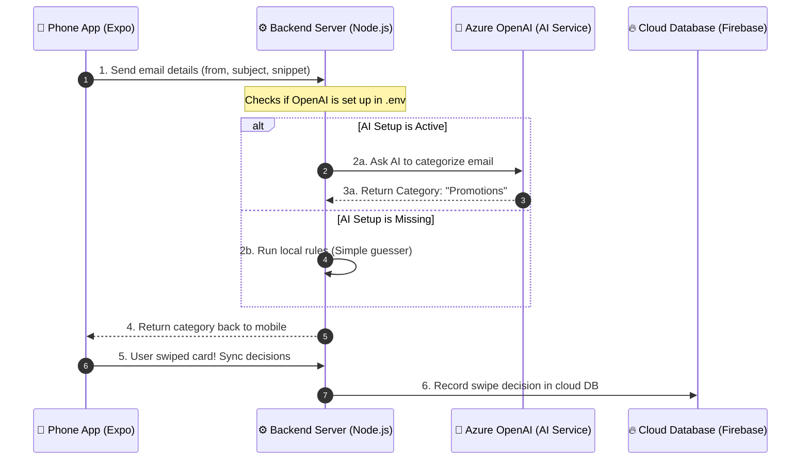

# 🏛️ Architecture Overview

Before we dive into the files, let's understand the big picture. Your application is a **Mail Tracker** app with a Tinder-style "swipe cards" interface. When you swipe a card left, it archives the email; swipe right, you keep it; swipe up, you star it; swipe down, you delete it.

To make this happen, we have three main modules working together in a **Monorepo** structure.

---

## 📂 Repository Structure

If you open the project, you will see three main folders under the root directory:

```text
Mail-Tracker-App/
├── apps/
│   ├── api/          # ⚙️ The Backend Server (Node.js & Express)
│   └── mobile/       # 📱 The Mobile App (React Native & Expo)
├── packages/
│   └── shared/       # 🔗 Shared Code & Data Structures (TypeScript Types)
├── legacy/           # 🗄️ Old code (.NET / C#) archived for reference
└── .env              # 🔑 Configuration file for passwords, keys, and setup
```

Let's look at the three main pillars:
1. **`apps/mobile`**: The user interface. It runs on the phone, displays the cards, senses your swipes, and communicates with Google/Gmail.
2. **`apps/api`**: The brain. It runs on your computer (in development), holds your OpenAI credentials, and processes requests like "please summarize my inbox" or "what category is this email?"
3. **`packages/shared`**: The bridge. It contains files that both the mobile app and the backend server import. This ensures both sides speak the same language.

---

## 🔄 The Flow of Data

Here is a visual map showing how a mobile screen request gets handled by the backend:



---

## 🔒 Three Golden Rules (Design Principles)

Your project follows three important rules designed to keep the app secure and easy to manage:

### 1. The Single `.env` File (Centralized Settings)
All settings—such as API keys, ports, database URLs, and passwords—live in **one single file** called `.env` at the root of the project.
- **Why?** It is standard practice in software engineering to keep secrets out of your code files. If you commit your password to GitHub, anyone can see it! A `.env` file is excluded from git (using `.gitignore`), keeping your secrets safe.
- **How?** Both the mobile app and backend read from this file at startup.

### 2. AI Stays on the Server (Protecting Keys)
The mobile app *never* directly talks to Azure OpenAI. Instead, the phone talks to your backend API, and the backend API talks to OpenAI.
- **Why?** If you build OpenAI keys directly into a mobile app, a hacker can unpack the app package (`.apk` or `.ipa`) and steal your API key, racking up thousands of dollars on your bill. 

### 3. Login Tokens Stay on the Phone
When you log in with Google, you receive an **OAuth Token** (a temporary key to read your emails). This token is stored only in the **Secure Storage** of your phone.
- **Why?** Gmail access is highly sensitive. By keeping it locally on the phone's secure hardware, we guarantee that the backend server or databases never store your email credentials, protecting your privacy.

---

## 🔗 Next Steps
- Head over to **[[02_Frontend_Expo_Mobile]]** to see how the phone app renders screens.
- Or check out **[[03_Backend_Node_Express]]** to see how the backend server processes data.
