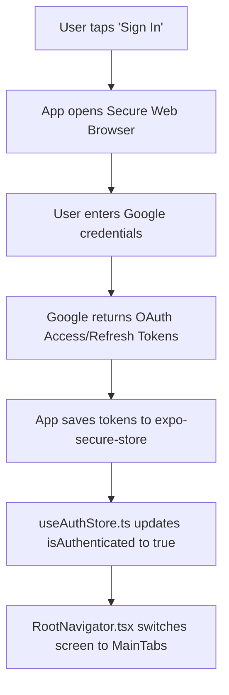
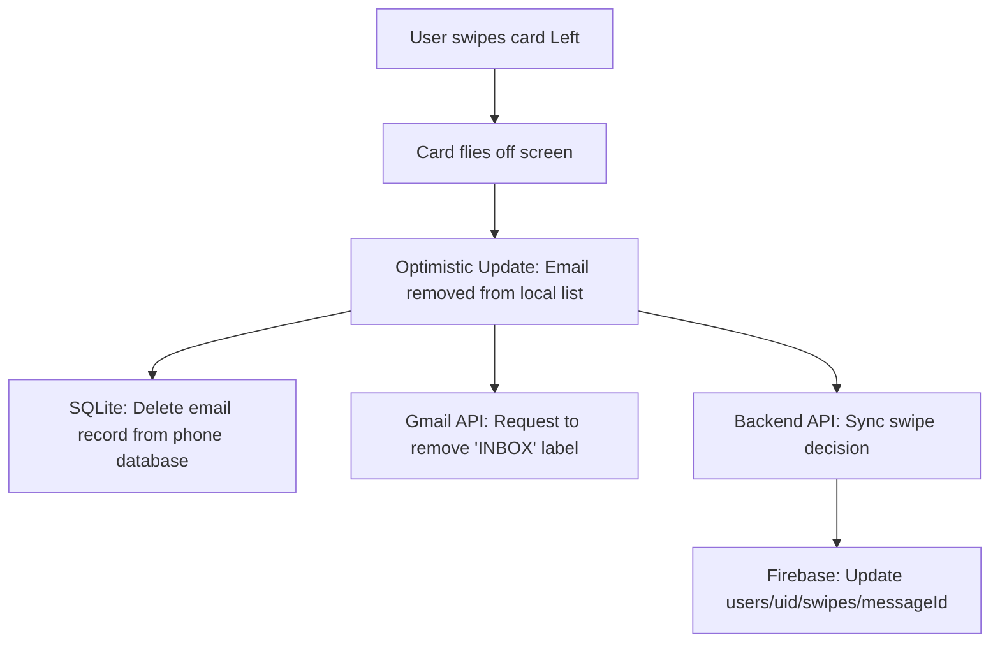

# 🔄 Step-by-Step Workflows

Let's trace exactly what happens under the hood for two main user actions. This will tie together all the concepts you've read about in the previous notes!

---

## 🔑 Workflow 1: Logging in with Google (OAuth)

When a new user launches the app, they see the Onboarding Screen. Here is what happens when they tap **"Sign in with Google"**:

### Detailed Breakdown:
1. **The Button Tap**: The user taps the login button on `OnboardingScreen.tsx`.
2. **The OAuth Handshake**: The app calls `authService.authorize()`. This uses the `react-native-app-auth` package to open a secure web browser overlay pointing to Google's authentication page.
3. **The User Consent**: The user logs in and consents to letting Mail Tracker read and modify their emails.
4. **Token Generation**: Google sends back three items:
   - **Access Token**: A temporary key (typically lasts 1 hour) that lets the app fetch your emails.
   - **Refresh Token**: A long-term key used to fetch a new Access Token automatically when the old one expires (so the user doesn't have to log in every single hour!).
   - **Expiration Date**: When the access token expires.
5. **Secure Storage**: The app writes these tokens into the phone's secure hardware enclave (Keychain on iOS, Keystore on Android) using `expo-secure-store`.
6. **State Transition**: The `useAuthStore` updates the `isAuthenticated` variable to `true`.
7. **Screen Switch**: The `RootNavigator.tsx` senses this change and automatically switches the screen display from the `OnboardingScreen` to the `MainTabs` screen.

---

## 📁 Workflow 2: Swiping an Email to Archive

You are on the Swipe screen, and you swipe a newsletter card to the **left** (Archive). Here is the sequence of events:

### Detailed Breakdown:
1. **The Swipe**: Your finger drags the card to the left past the threshold. `PanGestureHandler` senses this and triggers the `handleSwipeComplete("left")` function in `SwipeScreen.tsx`.
2. **The Flight Animation**: The card uses React Native's animation controller to fly off the left side of the screen.
3. **The Optimistic Update**: Inside `useInboxStore.ts`, the function `swipeEmail(index, "archive")` is called. It immediately slices this email out of the active list in memory. The screen updates instantly, making the app feel responsive.
4. **The SQLite Cache Update**: The store calls `emailStore.deleteEmail(messageId)`. The email is deleted from your offline SQLite database file on the phone.
5. **The Gmail API Update**: The app calls `gmailService.archiveMessage(messageId)`. This sends a request to Google's Gmail API:
   - It sends a `POST` request to `https://www.googleapis.com/gmail/v1/users/me/messages/<id>/modify` with the body `{"removeLabelIds": ["INBOX"]}`.
   - Because you removed the `"INBOX"` label, Gmail now considers the message archived!
6. **The Backend Sync**: The store checks if the user profile is active, and sends a request to your Node.js API:
   - It calls `mailTrackerApi.syncSwipe(...)` which does a request to `/sync/swipes`.
7. **The Cloud Mirror**: The backend API receives the swipe sync, verifies the API secret, and updates the **Firebase Realtime Database** path: `users/{userId}/swipes/{messageId}` with the value `{"decision": "archive", "atMs": <timestamp>}`.

---

## 🚨 What if something goes wrong? (The Rollback)

If the **Gmail API request fails** (for example, if you suddenly lose internet connection during step 5):
- The `try/catch` block in `useInboxStore.ts` catches the error.
- It triggers a **Rollback**:
  - The email is added back to the active list in memory at its original position.
  - The card animates back onto the screen stack.
  - It calls `emailStore.saveEmails(...)` to re-save the email to your local SQLite cache.
  - A small toast message pops up on the screen saying "Swipe action failed. Please check your internet connection."

This ensures your local cache, cloud database, and physical Gmail account are always kept in sync!

---

## 🎉 You're Ready to Code!

You now understand the architecture, structure, frontend, backend, and core workflows of your Mail Tracker application! 

Here are some good exercises to try next:
1. **Run the API server**: Run `npm run dev:api` and visit `http://localhost:5080/health` in your web browser.
2. **Run the Mobile app**: Run `npm run dev:mobile` and open the Expo Go app on your phone (or an emulator) to scan the QR code.
3. **Connect the real Screens**: Open `apps/mobile/src/navigation/MainTabs.tsx` and try to import the real screens instead of the placeholder functions!
