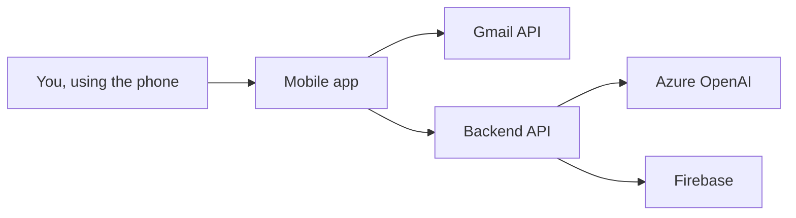

# Mail Tracker - Start Here

Welcome. This folder is written as an Obsidian note set for someone who is new to coding and inherited this project from generated code.

The short version: this project is a mobile Gmail app. The phone app signs in to Gmail, loads emails, shows them as swipe cards, and calls a backend server when it needs AI categorization, Firebase sync, or push notification features.

## The Big Picture

This repo has three main pieces:

1. [[01 Project Map|Project Map]]
   - Explains the folder structure and what each part is responsible for.

2. [[02 How The App Runs|How The App Runs]]
   - Explains what happens when the mobile app starts and what happens when the backend starts.

3. [[03 Mobile App Walkthrough|Mobile App Walkthrough]]
   - Explains the React Native app, screens, navigation, login state, inbox state, Gmail service, and local SQLite cache.

4. [[04 Backend API Walkthrough|Backend API Walkthrough]]
   - Explains the Express API, routes, AI categorization, Firebase sync, push notification routes, and request validation.

5. [[05 Data Flow Diagrams|Data Flow Diagrams]]
   - Shows beginner-friendly diagrams for sign-in, loading emails, swiping emails, and AI categorization.

6. [[06 Glossary For Beginners|Glossary For Beginners]]
   - Explains TypeScript, React Native, Expo, API, OAuth, tokens, SQLite, Firebase, Zod, Zustand, and other terms used in this codebase.

7. [[07 What Looks Finished And What Looks Placeholder|What Looks Finished And What Looks Placeholder]]
   - Separates real implemented features from things that appear incomplete, stubbed, or risky.

## What Kind Of Project Is This?

This is a **monorepo**. That means one Git repository contains multiple smaller projects:

- `apps/mobile` is the phone app.
- `apps/api` is the backend server.
- `packages/shared` contains TypeScript code shared by both.
- `docs` contains documentation.
- `legacy` appears to hold an older implementation/reference.

## Main Technologies

- **React Native**: lets JavaScript/TypeScript build a mobile app.
- **Expo**: tooling around React Native to make building/running easier.
- **Node.js**: JavaScript runtime used for the backend server.
- **Express**: web server framework for API routes.
- **TypeScript**: JavaScript with type checking.
- **Gmail API**: used by the phone app to read and modify Gmail messages.
- **Azure OpenAI**: used by the backend to categorize emails.
- **Firebase Realtime Database**: optional cloud sync storage.
- **SQLite**: local phone database for cached emails.
- **Zustand**: state management library used in the mobile app.
- **Zod**: runtime validation library used mostly by the backend/shared package.

## Mental Model

Think of the app as three cooperating workers:

The mobile app talks directly to Gmail because Gmail login tokens are stored on the device. The backend talks to Azure OpenAI because AI keys should not be shipped inside a mobile app.

## Where To Start Reading Code

Start here:

- `apps/mobile/App.tsx`
- `apps/mobile/src/navigation/RootNavigator.tsx`
- `apps/mobile/src/stores/useAuthStore.ts`
- `apps/mobile/src/stores/useInboxStore.ts`
- `apps/api/src/index.ts`
- `apps/api/src/app.ts`
- `apps/api/src/routes/ai.ts`
- `packages/shared/src/schemas.ts`

Those files show the main app path without making you open every file at once.

