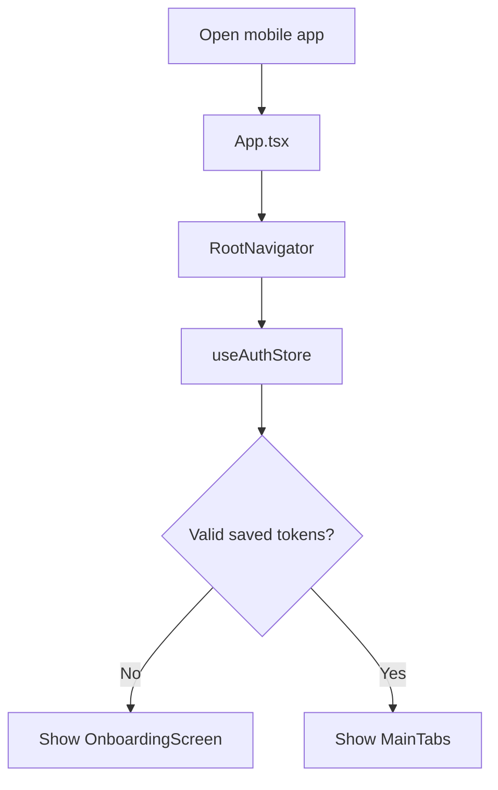
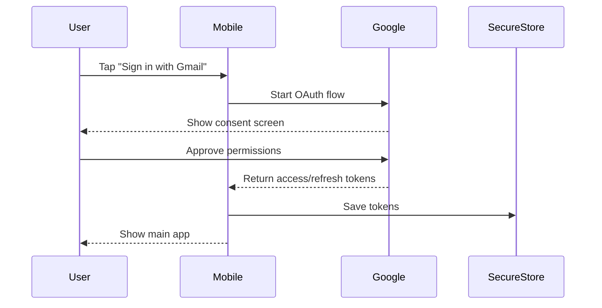
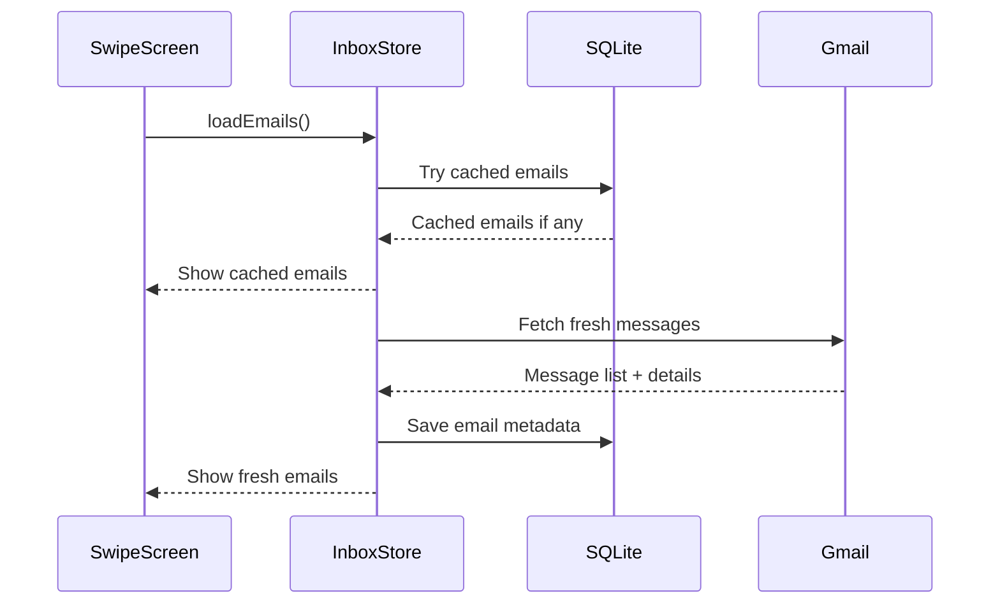
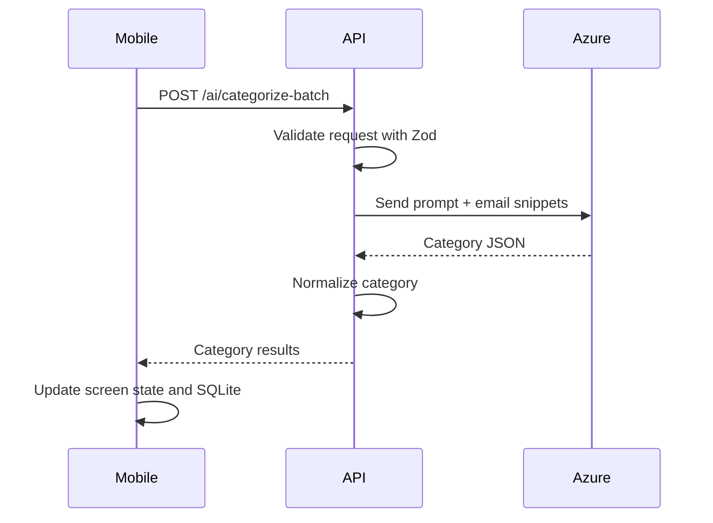
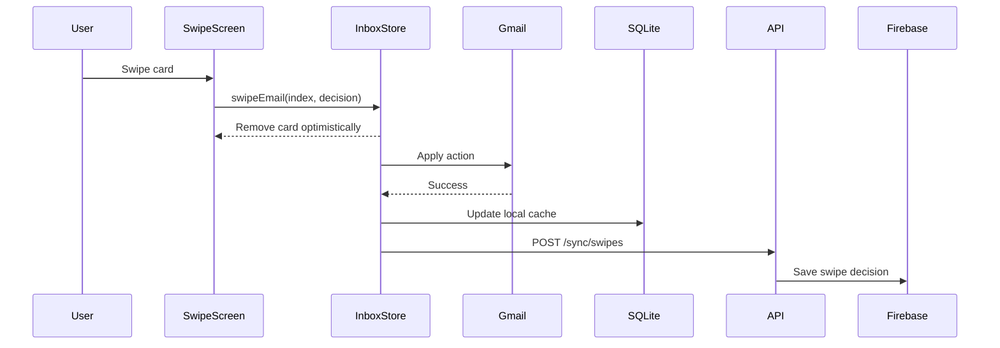
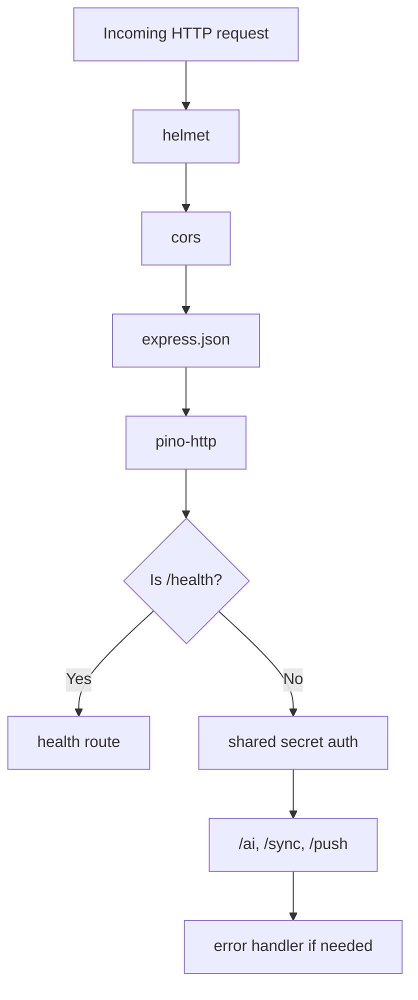

# Data Flow Diagrams

These diagrams show how data moves.

## App Startup

## Gmail Sign-In

## Loading Emails

## AI Categorization

## Swiping An Email

If Gmail action fails, `useInboxStore.ts` tries to put the email back into the list.

## Backend Request Flow

